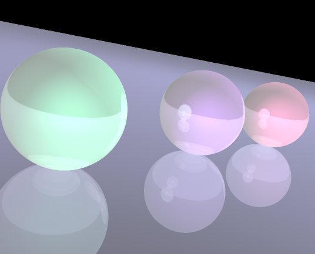

# Graphics Engine Using C Language

Render for version 2.

## Version 2
Phong illumination model was implemented, which consists of:

$$\left( \sum_{k=1}^n a_k b_k \right)^2 \leq \left( \sum_{k=1}^n a_k^2 \right) \left( \sum_{k=1}^n b_k^2 \right)$$

$$I_p = k_ai_a+\sum_{m\in \text{lights}}\left( k_d(\hat{L}_m\cdot\hat{N}) i_m + (\hat{R}_m\cdot\hat{V})^\alpha i_m) \right)$$

$$I_p = k_ai_a+\sum_{m\in \text{lights}}\left( k_d(\hat{L}_m\cdot\hat{N}) i_{m,d} + (\hat{R}_m\cdot\hat{V})^\alpha i_{m,s}) \right)$$
